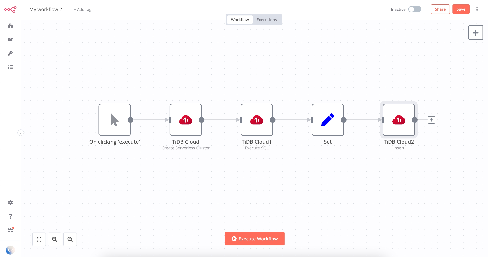
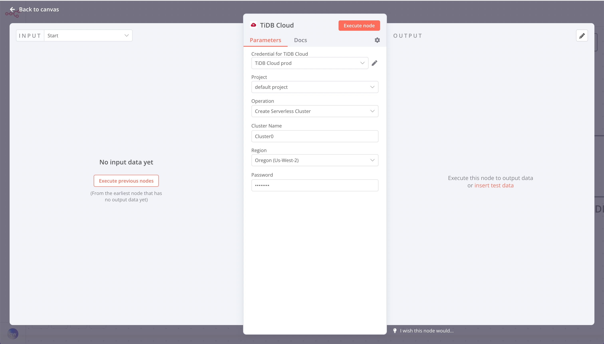
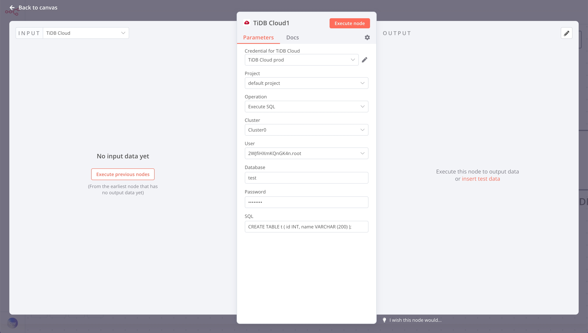
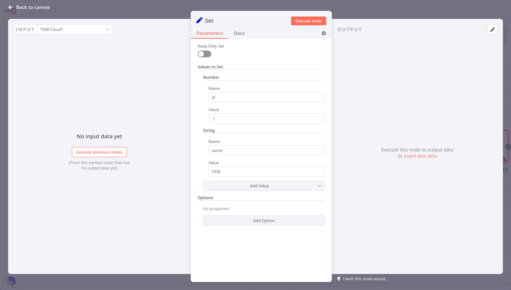
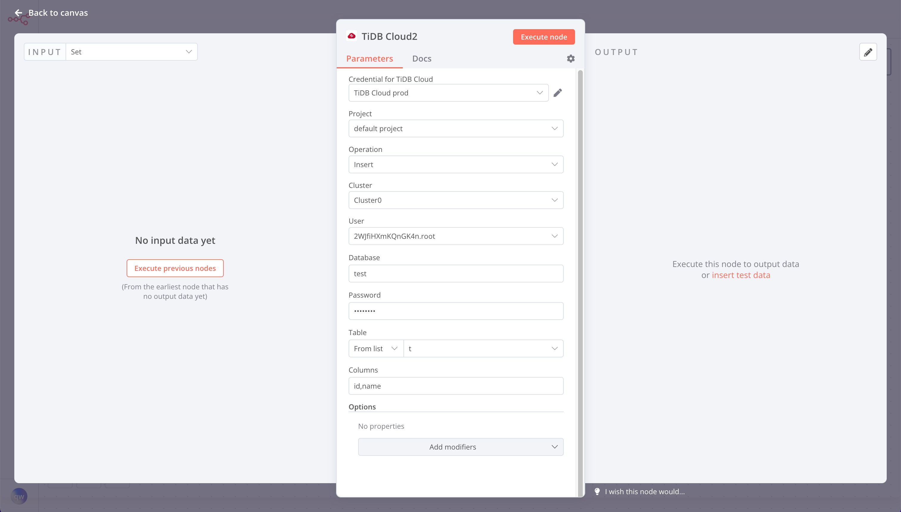

# Example Usage

This workflow allows you to create a TiDB Serverless cluster and insert some data into it. This example usage workflow would use the following nodes.
- [Manual Trigger](https://docs.n8n.io/integrations/builtin/core-nodes/n8n-nodes-base.manualworkflowtrigger/)
- [Set](https://docs.n8n.io/integrations/builtin/core-nodes/n8n-nodes-base.set/)
- [n8n-nodes-tidb-cloud]()

The final workflow should look like the following image.

## 1. Manual Trigger

Use this node to start a workflow by selecting Execute Workflow.

## 2. TiDB Cloud node (create a TiDB Serverless cluster)

1. Enter credentials for the TiDB Cloud node. Refer [here](../README.md#Credentials) to find out how to set it.
2. Choose your project from the ***Project*** list.
3. Select 'Create Serverless Cluster' from the ***Operation*** list.
4. Enter a cluster name in the ***Cluster Name*** field.
5. Select a region from the ***Region*** list.
6. Enter a password used to log in to your TiDB clusters in the ***Password*** field.
7. Click on ***Execute Node*** to run the node.

> Note: The step takes some 3 minutes to create a new TiDB Serverless cluster.

## 3. TiDB Cloud node (create a table)

1. Select the credentials that you entered in the previous node.
2. Choose your project from the ***Project*** list.
3. Select 'Execute SQL' from the ***Operation*** list.
4. Select the cluster that you created in the previous node. If you have not seen your new cluster, you need to wait a few minutes until the creating cluster mission is completed.
5. Choose a user in the ***User*** list. You needn't worry about your users as TiDB always creates a default user for you.
6. Enter `test` in the ***Database*** field.
7. Enter the password, set in the previous node, in the ***Password*** field.
8. Enter the following SQL in the ***SQL*** field:`CREATE TABLE t (id INT, name VARCHAR(200))`.
9. Click on ***Execute Node*** to run the node.

## 4. Set node (build data to insert)

1. Click on the ***Add Value*** button and select 'Number' from the dropdown list.
2. Enter `id` in the ***Name*** field.
3. Enter an id in the ***Value*** field.
4. Click on the ***Add Value*** button and select 'String' from the dropdown list.
5. Enter `name` in the ***Name*** field.
6. Enter a name in the ***Value*** field.
7. Click on ***Execute Node*** to run the node.

## 5. TiDB Cloud node (insert data)

1. Select the credentials that you entered in the previous node.
2. Choose your project from the ***Project*** list.
3. Select 'Insert' from the ***Operation*** list.
4. Select the cluster that you created in the previous node.
5. Choose a user in the ***User*** list.
6. Enter `test` in the ***Database*** field.
7. Enter the password, set in the previous node, in the ***Password*** field.
8. Choose the `t` table in the ***Table*** list.
9. Enter `id,name` in the ***Columns*** field.
10. Click on ***Execute Node*** to run the node.

